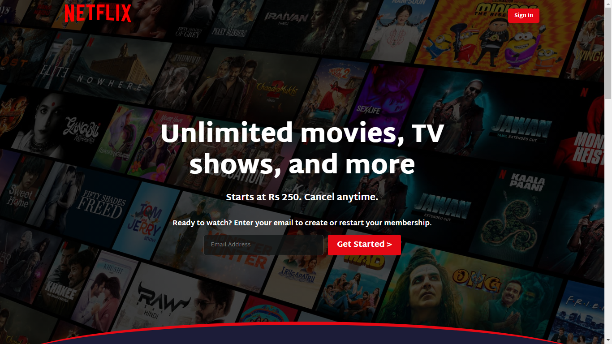

#  Netflix Clone

A fully responsive Netflix Clone built using HTML and CSS. This project replicates the user interface of Netflix, featuring a homepage, movie sections, hover effects, and a smooth UI design.

## 🚀 Features
- Fully responsive design
- Hover effects for a seamless user experience
- Clean and modern UI
- Built using HTML and CSS.

## 📸 Screenshots


## 🛠 Technologies Used
- HTML
- CSS

## 📌 How to Use
1. Clone the repository:  
    ```sh
    git clone https://github.com/sheikh92areeb/netflix-clone.git
    ```
2. Open index.html in a browser.

## 📜 License
This project is licensed under the MIT License. See the [LICENSE](LICENSE) file for details.

## 🔗 Live Demo
[Click here to view](https://sheikh92areeb.github.io/netflix-clone)

## ⭐ Contribute
Feel free to fork this repository and contribute by creating pull requests!

## 📬 Contact
For any inquiries or issues, contact me at [mareebsheikh92@gmail.com](mailto:mareebsheikh92@gmail.com)

---
### ⭐ If you find this helpful, please give it a star!